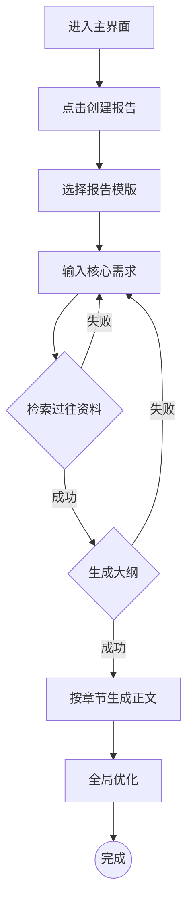

# PRD 各模块生成规范

## 模块总览

根据需求规模，选择需要生成的模块：

| 模块 | 小需求 | 中等需求 | 完整产品 |
|------|--------|---------|---------|
| 一、基础信息 | 可选 | ✅ | ✅ |
| 二、背景与目标 | ✅（精简版） | ✅ | ✅ |
| 三、用户画像 | ✅（精简版） | ✅ | ✅ |
| 四、功能规划 | ✅ | ✅ | ✅ |
| 五、流程设计 | ✅ | ✅ | ✅ |
| 六、详细功能需求 | ✅（核心功能） | ✅ | ✅ |
| 七、Agent/提示词设计 | 按需 | 按需 | ✅ |
| 八、数据需求与评测 | 跳过 | ✅ | ✅ |
| 九、非功能需求 | 跳过 | ✅（精简） | ✅ |
| 十、兜底策略 | ✅ | ✅ | ✅ |
| 十一、埋点设计 | 跳过 | ✅ | ✅ |
| 十二、角色权限 | 跳过 | 按需 | ✅ |

---

## 模块一：基础信息

**目的**：让任何人拿到文档都能快速了解版本状态。

**必含字段**：
- 产品版本号
- 创建时间、创建人
- 变更日志（时间、版本、变更人、变更内容）
- 名词解释（项目专有术语定义表）

**质量标准**：表格形式，不超过1页。名词解释必须覆盖所有AI相关术语（如RAG、Agent、Embedding、LLM等）和业务领域专有名词。

---

## 模块二：背景与目标

**核心原则**：这是整份PRD最重要的部分。必须让读者在30秒内理解：问题是什么、为什么重要、为什么现在就重要。

### 需求背景
**写法要求**：
- 用一段话讲清楚核心矛盾（谁遇到了什么问题，现状多痛，机会多大）
- 用「现状→痛点→机会点」三列表格做结构化展示
- 维度覆盖：业务、数据、专家知识、质量风险（根据实际情况调整）

**反面示例**：不要写"随着AI技术的发展..."这种空话，必须有具体的数据和场景。

### 项目目标
**写法要求**：
- 北极星指标：唯一、最关键的指标，衡量核心用户价值
- 商业指标：产品希望达成的商业效果（如营收提升、成本降低）
- 业务指标：产品希望为用户实现什么价值（如效率提升、工时缩短）
- 技术指标：评估模型本身性能（如准确率、事实性错误率）

**质量标准**：每个指标必须可量化、有明确的度量方式和数据来源。不能出现"提升用户体验"这种无法衡量的目标。

---

## 模块三：用户画像

**核心原则**：不是填模板，是真正理解用户。

**写法要求**：
- 为每类核心用户创建画像卡片，包含：角色名称、专业背景、核心任务、痛点、诉求
- 描述真实的使用场景，而非抽象概括
- 若有条件，附上原始用户流程图（用户在没有这个产品时是怎么完成工作的）

**质量标准**：
- 用户的痛点必须和"需求背景"中的问题对应
- 用户的诉求必须和"项目目标"中的指标对应
- 如果用户未提供画像信息，标注跳过，不要编造

### 竞品分析（可选）
如果用户提供了竞品信息或需要竞品分析：
- 竞品名称、对标功能点、借鉴要点
- 重点是"我们可以借鉴什么"而非"竞品有什么"

---

## 模块四：功能规划

**核心原则**：一张表讲清楚做什么、不做什么、先做什么。

**写法要求**：
- 用列表或表格形式，列出所有功能点
- 每个功能点一句话描述验收标准
- 标注优先级（P0最高→P3最低）
- 标注里程碑和预期完成日期（如用户提供了排期信息）

**优先级定义**：
- P0：用户价值高，实现成本低——必做
- P1：用户价值高，实现成本高——重点做
- P2：用户价值低，实现成本低——顺手做
- P3：用户价值低，实现成本高——先不做

---

## 模块五：流程设计

**核心原则**：用图说话，文字辅助。

**必须包含的图**：
1. **设计流程图**：用户操作的完整路径（从进入到完成）
2. **核心交互逻辑图**：用户与系统的关键交互节点
3. **系统处理流程**：后端AI处理链路（尤其是Agent调用链）

**图表规范**：
- 给开发看：必须使用Mermaid代码块
- 给AI看：使用Mermaid代码块
- 给业务方：可用文字描述，附Mermaid作补充

**Mermaid流程图示例**：


---

## 模块六：详细功能需求

**核心原则**：让开发人员看完就能动手，不需要再来问产品。

**每个功能必须包含**：
- **入口**：用户从哪里触发这个功能
- **交互**：用户的操作步骤和系统的响应
- **反馈**：系统在各种状态下给用户的反馈（加载中、成功、失败）
- **异常处理**：格式不支持、文件过大、网络中断、解析失败等情况

**按产品类型侧重**：
- 工具型：重点描述每个页面/组件的交互细节
- Agent型：重点描述Agent的输入输出和调用逻辑
- 对话型：重点描述对话流、意图识别、多轮管理

---

## 模块七：Agent/提示词设计

**⚠️ 特殊处理**：此模块不可直接生成，必须先引导用户提供业务逻辑后再写。

→ 详见 SKILL.md 第五步的处理流程

**Agent设计模板**：

```markdown
### [Agent名称]

#### Role（角色）
[身份定义和专业能力描述]

#### Inputs（输入）
[列出所有需要的上下文变量，使用 {{变量名}} 标记]

#### Action Path（行动路径）
[按序号列出执行步骤]

#### Tool Use Rules（工具调用规范）
[每个工具的入参要求、调用时机、目的]

#### Output Specifications（输出要求）
[输出格式、JSON结构定义]

#### Constraints（强约束）
[不可违反的规则]
```

**全局上下文管理模板**：

```json
{
  "doc_config": {
    "title": "项目标题",
    "domain": "所属领域",
    "doc_type": "文档类型",
    "style": "文档风格",
    "target_words": "目标总字数"
  },
  "global_facts": {
    "key_metrics": {},
    "project_scope": ""
  },
  "writing_memory": {
    "chapter_summaries": [],
    "global_terminology": [],
    "last_chunk_ending": ""
  },
  "runtime_data": {
    "current_rag_results": "",
    "user_requirements": ""
  }
}
```

---

## 模块八：数据需求与评测

**核心原则**：AI产品上线前必须有评测集，否则无法判断效果。

**写法要求**：
- 评测集的构建方式（谁提供问题、谁定义标准答案）
- 评测维度（如：精准事实检索、总结能力、边界处理能力）
- 评测集规模要求
- 评测指标和通过标准

**质量标准**：评测集必须由业务专家和产品/算法团队协作完成，不能只有技术人员自定义。

---

## 模块九：非功能需求

**写法要求**：用表格列出，覆盖以下维度：
- 性能：响应时间、并发量、加载时间
- 可靠性：可用性、容错性、数据完整性
- 安全性：认证、授权、数据加密、审计日志
- 易用性：学习成本、操作效率、可访问性
- 兼容性：浏览器、文件格式、设备
- 可维护性：模块化、可配置性

---

## 模块十：兜底策略

**核心原则**：AI产品PRD必须包含此模块，没有兜底的AI产品不能上线。

**写法要求**：用表格列出，每行包含：
- 触发条件：什么情况下触发兜底
- 系统行为：系统如何处理
- 用户感知：用户看到什么提示

**常见兜底场景**：
- 检索/召回质量低
- 文档上传/解析失败
- AI服务超时/失败
- 网络中断
- 用户输入超出能力边界

---

## 模块十一：埋点设计

**核心原则**：构建用户行为漏斗，度量核心功能使用率，监控产品性能。

**写法要求**：
- 按用户旅程阶段组织（创建→生成→交互→产出）
- 每个埋点包含：埋点ID、事件名称、事件描述、触发条件

---

## 模块十二：角色权限

**写法要求**：
- 用矩阵表格展示：行=功能点，列=角色
- 用 ✅/❌ 标记各角色的权限
