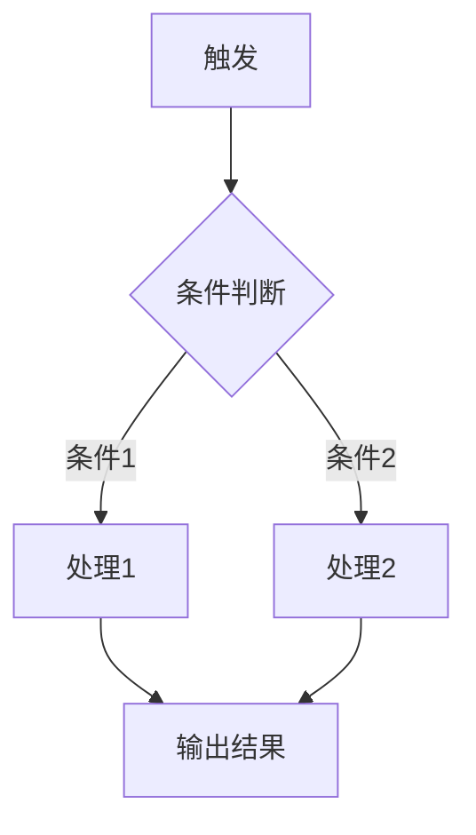

# PRD模块详细生成规范

本文档定义了面向AI编程Agent的PRD的10个模块的详细生成规范。每个模块包含：目的说明、必含字段、写作规范、示例片段。

---

## 模块1: 项目概述

**目的**：让AI编程Agent在30秒内理解要建什么、为谁建、核心价值是什么。

**必含字段**：

```markdown
## 1. 项目概述

### 产品名称
[产品名]

### 一句话描述
[用一句话说清楚这个产品是什么、给谁用、解决什么问题]

### 核心价值主张
- 用户痛点：[从调研报告中提炼的核心痛点]
- 我们的解法：[一句话描述产品如何解决这个痛点]
- 差异化：[和现有竞品/方案相比，我们的核心不同是什么]

### 目标用户
- 主要用户：[画像描述，包含年龄段/职业/核心诉求]
- 使用场景：[用户在什么情况下会打开这个产品]

### MVP范围声明
- ✅ V1做：[功能列表，每条一句话]
- ❌ V1不做：[功能列表 + 不做的原因]

### 核心用户流程
[用一段文字或Mermaid描述用户从进入到完成核心任务的最短路径]
```

**写作规范**：
- "一句话描述"必须通过"电梯测试"——对一个不了解项目的人说这一句话，对方能立刻理解产品是什么
- "MVP范围声明"直接复用Step 2的讨论结果，不重新发散
- 核心用户流程必须体现最小闭环，步骤不超过5步

---

## 模块2: 技术栈与环境配置

**目的**：让AI编程Agent执行 `npm create` 或类似命令时知道用什么、装什么、怎么配。

**必含字段**：

```markdown
## 2. 技术栈与环境配置

### 技术栈总览
| 层面 | 选型 | 版本 | 用途 |
|------|------|------|------|
| 前端框架 | [如 Next.js] | [如 14.x] | [核心框架] |
| UI组件库 | [如 shadcn/ui] | [latest] | [基础组件] |
| 样式方案 | [如 Tailwind CSS] | [3.x] | [样式系统] |
| 状态管理 | [如 Zustand] | [4.x] | [全局状态] |
| AI SDK | [如 Vercel AI SDK] | [3.x] | [AI模型接入] |
| 数据库 | [如 Supabase] | [latest] | [数据持久化] |
| 部署 | [如 Vercel] | — | [托管与部署] |

### 项目初始化命令
```bash
# 完整的初始化命令序列，AI编程Agent可以直接执行
npx create-next-app@latest [项目名] --typescript --tailwind --eslint --app --src-dir
cd [项目名]
# 依赖安装
npm install [所有需要的包，完整列出]
```

### 项目目录结构
```
src/
├── app/                    # Next.js App Router 页面
│   ├── layout.tsx          # 根布局
│   ├── page.tsx            # 首页
│   └── [其他页面]/
├── components/             # React 组件
│   ├── ui/                 # 基础UI组件（shadcn等）
│   └── [业务组件]/
├── lib/                    # 工具函数与配置
│   ├── ai.ts               # AI模型配置与调用封装
│   ├── db.ts               # 数据库连接
│   └── utils.ts            # 通用工具函数
├── hooks/                  # 自定义React Hooks
├── stores/                 # 状态管理Store
├── types/                  # TypeScript类型定义
└── styles/                 # 全局样式与Design Tokens
    └── tokens.css          # CSS变量（Design Tokens）
```

### 环境变量
```env
# .env.local 模板
# AI模型配置（用户可配置）
AI_PROVIDER=openai              # openai | anthropic | custom
AI_MODEL=gpt-4o                 # 具体模型名
AI_API_KEY=                     # 用户填入
AI_BASE_URL=                    # 自定义API地址（可选）
AI_MAX_TOKENS=4096              # 最大输出token

# 数据库（如需）
DATABASE_URL=

# 其他
NEXT_PUBLIC_APP_NAME=[产品名]
```
```

**写作规范**：
- 版本号必须具体，不写"latest"（除非确实跟随最新即可）
- 初始化命令序列必须完整到可以直接复制粘贴执行
- 目录结构中每个文件/文件夹必须有注释说明用途
- 环境变量必须标注哪些是用户需要配置的、哪些有默认值

---

## 模块3: 设计规范（Design Tokens）

**目的**：把Step 4确定的前端风格转化为Agent可直接使用的CSS变量和设计常量。

**必含字段**：

```markdown
## 3. 设计规范（Design Tokens）

### 设计理念
[一句话描述风格方向，如"柔和克制的疗愈感，用大量留白和圆润形态传递安全与温暖"]

### 色彩系统
```css
:root {
  /* 主色 */
  --color-primary: #[hex];
  --color-primary-hover: #[hex];
  --color-primary-light: #[hex];   /* 用于背景 */
  
  /* 辅助色 */
  --color-secondary: #[hex];
  
  /* 强调色 */
  --color-accent: #[hex];
  
  /* 语义色 */
  --color-success: #[hex];
  --color-warning: #[hex];
  --color-error: #[hex];
  --color-info: #[hex];
  
  /* 中性色 */
  --color-bg-primary: #[hex];      /* 页面背景 */
  --color-bg-secondary: #[hex];    /* 卡片/区块背景 */
  --color-bg-tertiary: #[hex];     /* 输入框等 */
  --color-text-primary: #[hex];    /* 主文字 */
  --color-text-secondary: #[hex];  /* 次要文字 */
  --color-text-muted: #[hex];      /* 弱化文字 */
  --color-border: #[hex];          /* 边框 */
  --color-divider: #[hex];         /* 分割线 */
}

/* 暗色模式（如需） */
[data-theme="dark"] {
  /* 覆盖对应变量 */
}
```

### 字体系统
```css
:root {
  --font-display: '[标题字体名]', [fallback];
  --font-body: '[正文字体名]', [fallback];
  --font-mono: '[代码字体名]', monospace;
  
  /* 字号 */
  --text-xs: 0.75rem;     /* 12px */
  --text-sm: 0.875rem;    /* 14px */
  --text-base: 1rem;      /* 16px */
  --text-lg: 1.125rem;    /* 18px */
  --text-xl: 1.25rem;     /* 20px */
  --text-2xl: 1.5rem;     /* 24px */
  --text-3xl: 1.875rem;   /* 30px */
  --text-4xl: 2.25rem;    /* 36px */
  
  /* 行高 */
  --leading-tight: 1.25;
  --leading-normal: 1.5;
  --leading-relaxed: 1.75;
  
  /* 字重 */
  --font-normal: 400;
  --font-medium: 500;
  --font-semibold: 600;
  --font-bold: 700;
}
```

### 间距与圆角
```css
:root {
  /* 间距（基于4px栅格） */
  --space-1: 0.25rem;   /* 4px */
  --space-2: 0.5rem;    /* 8px */
  --space-3: 0.75rem;   /* 12px */
  --space-4: 1rem;      /* 16px */
  --space-6: 1.5rem;    /* 24px */
  --space-8: 2rem;      /* 32px */
  --space-12: 3rem;     /* 48px */
  --space-16: 4rem;     /* 64px */
  
  /* 圆角 */
  --radius-sm: [值];
  --radius-md: [值];
  --radius-lg: [值];
  --radius-xl: [值];
  --radius-full: 9999px;
  
  /* 阴影 */
  --shadow-sm: [值];
  --shadow-md: [值];
  --shadow-lg: [值];
}
```

### 动效规范
```css
:root {
  --transition-fast: 150ms ease;
  --transition-base: 250ms ease;
  --transition-slow: 350ms ease;
  --transition-spring: 500ms cubic-bezier(0.34, 1.56, 0.64, 1);
}
```

### 组件基础样式指引
| 组件类型 | 圆角 | 内边距 | 阴影 | 备注 |
|---------|------|--------|------|------|
| 卡片 | --radius-lg | --space-6 | --shadow-md | [额外说明] |
| 按钮-主要 | --radius-md | --space-3 --space-6 | none | [额外说明] |
| 按钮-次要 | --radius-md | --space-3 --space-6 | none | border: 1px solid --color-border |
| 输入框 | --radius-md | --space-3 --space-4 | none | [额外说明] |
| 对话气泡 | --radius-xl | --space-4 --space-6 | --shadow-sm | [额外说明] |
```

**写作规范**：
- 所有颜色必须给出具体hex值，不用颜色名称
- 字体必须给出完整的Google Fonts引入URL或CDN链接
- 间距系统必须基于统一栅格（推荐4px或8px）
- 组件样式指引中只列MVP涉及的组件类型

---

## 模块4: 页面与组件清单

**目的**：让AI编程Agent知道要创建哪些文件、每个页面/组件的职责和结构。

**必含字段**：

```markdown
## 4. 页面与组件清单

### 页面路由
| 路由 | 页面名称 | 文件路径 | 功能描述 | 布局 |
|------|---------|---------|---------|------|
| / | 首页 | app/page.tsx | [描述] | 默认布局 |
| /[其他] | [名称] | app/[路径]/page.tsx | [描述] | [布局] |

### 组件树
[用缩进或Mermaid展示组件层级关系]

### 核心组件定义
每个组件使用以下格式定义：

#### [ComponentName]
- **文件路径**：`components/[path]/[ComponentName].tsx`
- **职责**：[一句话说清楚这个组件做什么]
- **Props**：
  ```typescript
  interface [ComponentName]Props {
    [prop]: [type]; // [说明]
  }
  ```
- **内部状态**：[列出组件自身管理的状态，如无则写"无"]
- **依赖**：[列出依赖的其他组件/hooks/stores]
- **交互行为**：
  - [交互1]：[用户操作] → [系统响应]
  - [交互2]：[用户操作] → [系统响应]
```

**写作规范**：
- 每个组件的Props必须用TypeScript接口定义
- 组件职责必须遵守单一职责原则
- 交互行为用"用户操作 → 系统响应"格式描述
- 组件命名用PascalCase，文件命名用PascalCase.tsx

---

## 模块5: AI能力配置

**目的**：定义产品中所有AI调用的配置方式、调用逻辑和用户可配置项。

**必含字段**：

```markdown
## 5. AI能力配置

### AI配置架构
用户可在设置页面配置以下参数（运行时生效）：

```typescript
interface AIConfig {
  provider: 'openai' | 'anthropic' | 'custom';
  model: string;          // 如 'gpt-4o', 'claude-sonnet-4-20250514'
  apiKey: string;          // 用户自己的API Key
  baseUrl?: string;        // 自定义API地址
  maxTokens: number;       // 最大输出token
  temperature: number;     // 温度参数
}
```

### AI调用点清单
| 调用点 | 触发时机 | 输入 | 期望输出 | 超时(s) | 降级策略 |
|-------|---------|------|---------|--------|---------|
| [调用点1] | [用户什么操作触发] | [输入内容] | [期望返回什么] | [秒] | [超时/失败时怎么办] |

### Prompt设计
每个AI调用点的提示词设计：

#### [调用点名称] Prompt
**System Prompt**：
```
[具体的system prompt内容]
```

**User Prompt模板**：
```
[模板内容，用 {{变量名}} 标记动态部分]
```

**输出格式要求**：
```json
{
  "[字段]": "[类型] - [说明]"
}
```

### 流式响应处理
[如产品需要流式输出，描述前端如何处理stream，包括loading状态、逐字显示、中断处理]
```

**写作规范**：
- 每个AI调用点必须有明确的降级策略
- Prompt内容必须具体完整，不写"根据场景动态生成"
- 所有用户可配置项必须有合理的默认值
- 如有多个AI调用点，说明它们之间的依赖/串联关系

---

## 模块6: 数据模型

**目的**：定义所有数据实体和它们之间的关系，让Agent知道要建什么表/存什么数据。

**必含字段**：

```markdown
## 6. 数据模型

### 数据实体

#### [EntityName]
```typescript
interface [EntityName] {
  id: string;                    // UUID，主键
  [field]: [type];               // [说明]
  createdAt: Date;               // 创建时间
  updatedAt: Date;               // 更新时间
}
```

### 实体关系
[用Mermaid ER图或文字描述实体间的关系]

```mermaid
erDiagram
    [Entity1] ||--o{ [Entity2] : "has many"
    [Entity2] }o--|| [Entity3] : "belongs to"
```

### 本地存储（如使用localStorage/IndexedDB）
| Key | 数据类型 | 用途 | 过期策略 |
|-----|---------|------|---------|

### 数据流向
[描述数据从用户输入到持久化到展示的流向]
```

**写作规范**：
- 所有实体必须用TypeScript接口定义
- 每个字段必须标注类型和用途说明
- 如果使用数据库，给出建表SQL或ORM schema
- MVP阶段如果只用本地存储，明确标注"V1使用localStorage，V2迁移到[数据库]"

---

## 模块7: 核心业务逻辑

**目的**：描述产品的核心功能逻辑，让Agent知道每个功能"怎么运作"。

**必含字段**：

```markdown
## 7. 核心业务逻辑

### [功能名称]

#### 触发条件
[用户什么操作触发这个功能]

#### 处理流程


#### 业务规则
- 规则1：[具体规则]
- 规则2：[具体规则]

#### 输入输出
- **输入**：[具体描述]
- **输出**：[具体描述]
- **副作用**：[如修改状态、触发通知等]

#### 边界情况
| 场景 | 系统行为 | 用户感知 |
|------|---------|---------|
| [边界1] | [处理方式] | [用户看到什么] |
```

**写作规范**：
- 每个核心功能必须有Mermaid流程图
- 业务规则必须可枚举，不用"等等"、"之类的"
- 边界情况至少覆盖3种异常场景
- 涉及AI调用的步骤，标注"→ 参见模块5: [调用点名称]"

---

## 模块8: 状态管理

**目的**：定义全局状态结构，让Agent知道数据如何在组件间流转。

**必含字段**：

```markdown
## 8. 状态管理

### 全局状态结构

```typescript
// stores/[storeName].ts
interface AppState {
  // UI状态
  [uiState]: [type];
  
  // 业务数据
  [dataState]: [type];
  
  // AI相关
  [aiState]: [type];
}

interface AppActions {
  [action]: ([params]) => [returnType];
}
```

### Store划分
| Store名称 | 职责 | 包含状态 |
|-----------|------|---------|
| [store1] | [职责] | [状态列表] |

### 状态流转
[用Mermaid或文字描述关键状态的流转路径]

### 持久化策略
[哪些状态需要持久化到localStorage/DB，怎么做]
```

**写作规范**：
- 使用TypeScript定义所有状态和Action的类型
- Store按职责拆分，单个Store不超过10个状态字段
- 明确标注哪些状态是持久化的、哪些是临时的

---

## 模块9: 错误处理与兜底策略

**目的**：确保AI编程Agent生成的代码在各种异常情况下有合理的行为。

**必含字段**：

```markdown
## 9. 错误处理与兜底策略

### 错误分类
| 错误类型 | 触发条件 | 处理方式 | 用户提示 | 恢复策略 |
|---------|---------|---------|---------|---------|
| AI服务超时 | 响应>30s | 中断请求 | "AI思考超时，请重试" | 提供重试按钮 |
| AI服务错误 | API返回4xx/5xx | 捕获错误 | "服务暂时不可用" | [降级方案] |
| API Key无效 | 401响应 | 拦截请求 | "请检查API Key设置" | 跳转设置页 |
| 网络断开 | fetch失败 | 检测网络 | "网络连接中断" | 自动重连 |
| 输入超长 | 超过token限制 | 截断/分段 | "内容较长，已自动分段" | — |

### 全局错误边界
[描述React Error Boundary的配置和降级UI]

### Loading状态规范
| 场景 | Loading方式 | 持续时间预期 | 超时处理 |
|------|-----------|------------|---------|
| [场景1] | [skeleton/spinner/streaming] | [预期秒数] | [超时后做什么] |

### 空状态设计
| 页面/组件 | 空状态文案 | 引导动作 |
|----------|-----------|---------|
| [页面1] | "[文案]" | [引导按钮/链接] |
```

**写作规范**：
- 每个AI调用点必须有对应的超时和失败处理
- Loading方式要具体（skeleton/spinner/streaming text），不写"显示加载中"
- 空状态必须有引导动作，不允许出现"什么都没有"的死胡同

---

## 模块10: 迭代Roadmap

**目的**：记录V2+的功能规划和迭代方向，让用户改PRD时有上下文。

**必含字段**：

```markdown
## 10. 迭代Roadmap

### V1 → V2 升级清单
| 功能 | 优先级 | 前置依赖 | 预估复杂度 | 备注 |
|------|-------|---------|-----------|------|
| [功能1] | P1 | [依赖什么] | [高/中/低] | [为什么在V2做] |

### 长期方向
[2-3句话描述产品的长期愿景和可能的演进路径]

### 已知技术债
| 技术债 | 影响范围 | 建议解决时机 |
|-------|---------|------------|
| [债务1] | [影响什么] | [V2/V3/需要时] |
```

**写作规范**：
- V2功能直接从Step 2的"不做清单"中提取，保持一致
- 每个V2功能标注前置依赖，帮用户理解迭代顺序
- 已知技术债要诚实记录MVP阶段的妥协

---

## PRD文档头部模板

每份PRD的开头统一使用以下格式：

```markdown
# [产品名称] — 项目规范

> 本文档是面向AI编程Agent（Cursor/Claude Code/Trae等）的项目执行规范。
> 按模块组织，每个模块可独立修改后重新执行。

| 字段 | 内容 |
|------|------|
| 版本 | v1.0 |
| 创建日期 | [日期] |
| 最后更新 | [日期] |
| 状态 | 撰写中 / 已完成 |
| 目标Agent | Cursor / Claude Code / Trae / Codex |
| 技术栈 | [一句话概括] |

---

## 目录
1. [项目概述](#1-项目概述)
2. [技术栈与环境配置](#2-技术栈与环境配置)
3. [设计规范（Design Tokens）](#3-设计规范design-tokens)
4. [页面与组件清单](#4-页面与组件清单)
5. [AI能力配置](#5-ai能力配置)
6. [数据模型](#6-数据模型)
7. [核心业务逻辑](#7-核心业务逻辑)
8. [状态管理](#8-状态管理)
9. [错误处理与兜底策略](#9-错误处理与兜底策略)
10. [迭代Roadmap](#10-迭代roadmap)

---
```
